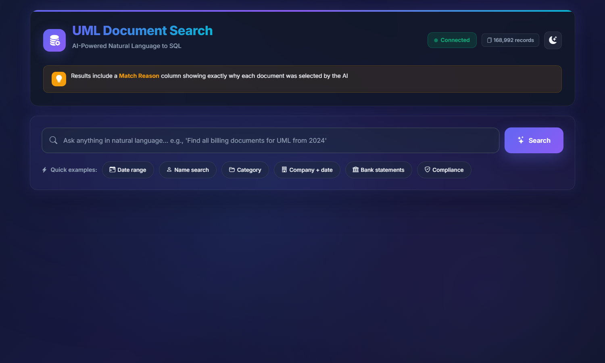
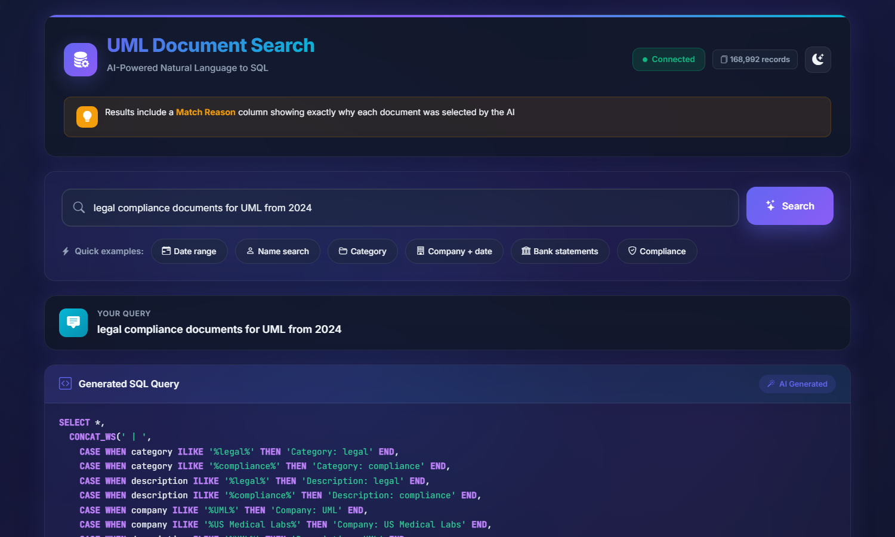
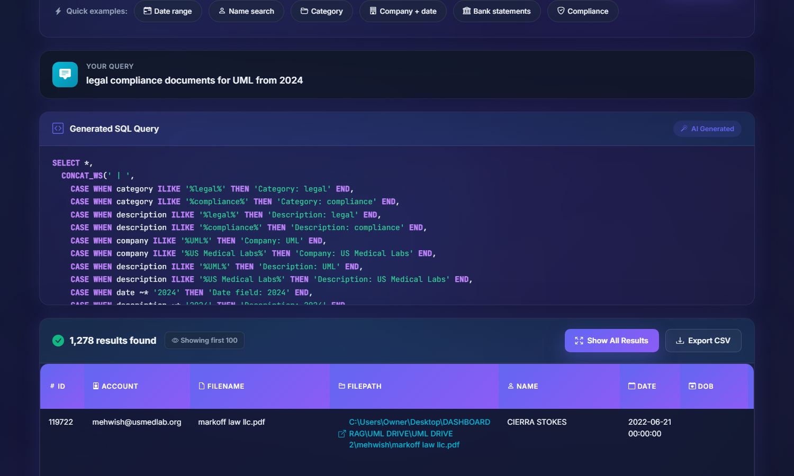
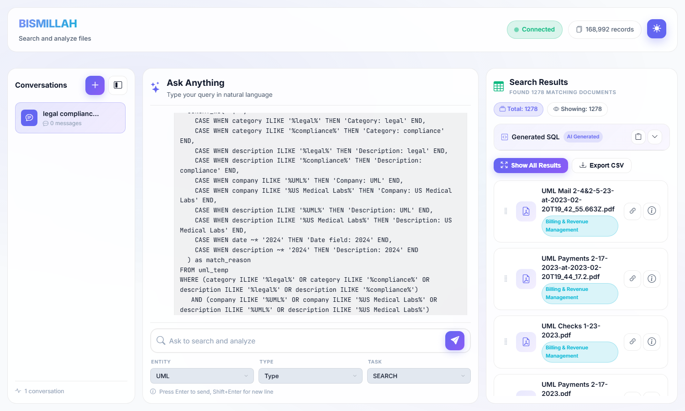
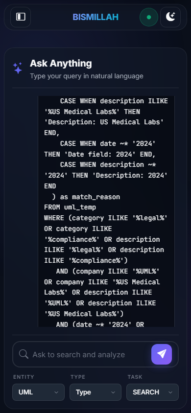
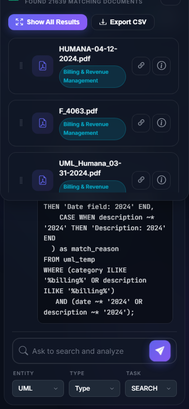
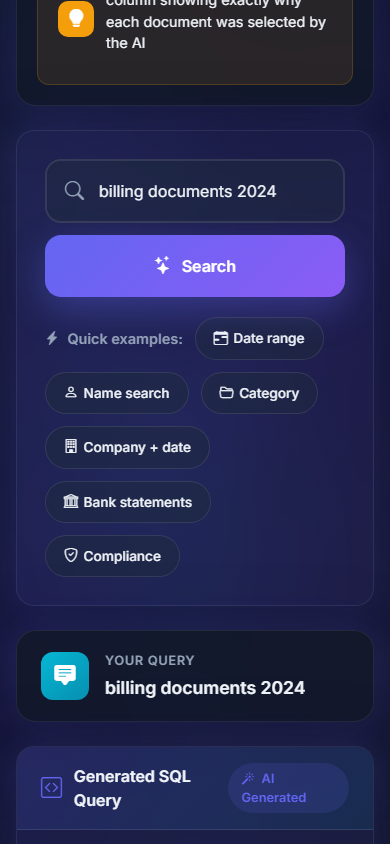
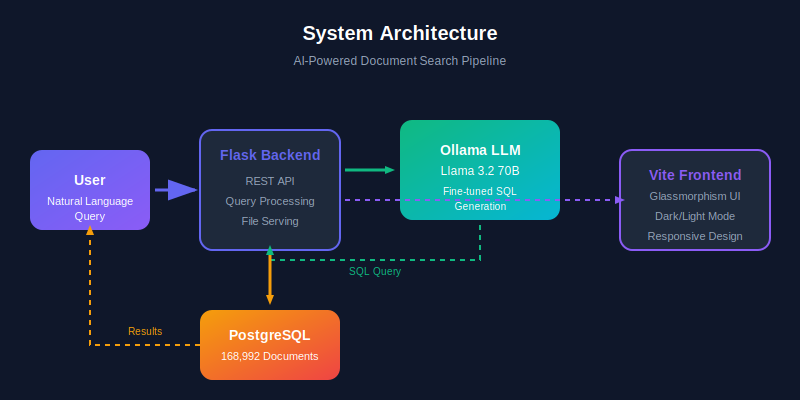

<p align="center">
  
  
  
  
</p>

<h1 align="center">AI Document Search Dashboard</h1>

<p align="center">
  <strong>Natural language to SQL - Search 168,000+ documents instantly</strong>
</p>

<p align="center">
  
  
  
  
</p>

---

## Dashboard Preview

<p align="center">
  
</p>

---

## AI-Powered Search with Fine-tuned SQL Generation

<p align="center">
  
</p>

<p align="center">
  <em>Natural language queries converted to optimized, fine-tuned SQL with match explanations</em>
</p>

---

## Search Results with Match Reason

<p align="center">
  
</p>

<p align="center">
  <em>Every result includes a Match Reason showing exactly why the document was selected</em>
</p>

---

## Light Mode Support

<p align="center">
  
</p>

---

## Mobile Responsive Design

<p align="center">
  
  
  
</p>

---

## System Architecture

<p align="center">
  
</p>

---

## What You Can Do

| Action | Example Query |
|--------|---------------|
| **Search by Date Range** | `"documents from june 2023 to december 2024"` |
| **Search by Name** | `"find all files for John Smith"` |
| **Search by Category** | `"legal compliance documents"` |
| **Search by Company + Date** | `"billing documents for UML from 2024"` |
| **Find Bank Statements** | `"bank statements from january to july 2025"` |
| **Compliance Search** | `"all compliance and audit documents"` |
| **Multi-criteria Search** | `"HR documents for employee onboarding 2024"` |

---

## Key Features

| Feature | Description |
|---------|-------------|
| **Natural Language Search** | Ask questions in plain English - AI converts to SQL |
| **Fine-tuned SQL Queries** | Optimized prompts handle data inconsistencies, typos, and format variations |
| **Match Reason Column** | See exactly why each document matched your search |
| **168,000+ Documents** | Instant search across massive document database |
| **Fuzzy Matching** | Handles spelling errors and naming variations automatically |
| **Export to CSV** | Download search results for further analysis |
| **Dark/Light Mode** | Modern glassmorphism UI with theme toggle |
| **Mobile Responsive** | Full functionality on any device |
| **File Preview** | Open documents directly from search results |

---

## Fine-tuned SQL Generation

The system uses carefully crafted prompts that handle real-world data quality issues:

- **Name variations**: `"umair"`, `"Umair"`, `"UMAIR"`, `"Umar"` all match
- **Date formats**: `"june 2023"`, `"6/2023"`, `"2023-06-01"` all work
- **Company aliases**: `"UML"` = `"US Medical Labs"` = `"USMedLab"`
- **Category matching**: `"Legal & Compliance"` = `"legal"` = `"compliance"`

---

## Tech Stack

| Layer | Technology |
|-------|------------|
| **Frontend** | Vite, Bootstrap 5, Vanilla JS, CSS3 Glassmorphism |
| **Backend** | Flask, Python 3.10+, REST API |
| **AI** | Ollama, Llama 3.2 70B |
| **Database** | PostgreSQL |

---

## Quick Start

### Prerequisites
- Python 3.10+
- Node.js 18+
- PostgreSQL
- [Ollama](https://ollama.ai/) with Llama 3.2 70B

### Installation

```bash
# Clone the repository
git clone https://github.com/zeeza18/DASHBOARD-SOLUMI.git
cd DASHBOARD-SOLUMI

# Install Ollama and pull model
ollama pull llama3.2:70b

# Backend setup
cd backend
python -m venv .venv
source .venv/bin/activate  # Windows: .venv\Scripts\activate
pip install -r requirements.txt

# Frontend setup
cd ../frontend
npm install
npm run build
```

### Configuration

Create a `.env` file:

```env
DB_HOST=localhost
DB_PORT=5432
DB_NAME=your_database
DB_USER=postgres
DB_PASSWORD=your_password
OLLAMA_HOST=http://localhost:11434
FILE_BASE_PATH=/path/to/documents
```

### Run

```bash
ollama serve
python backend/app.py
```

Visit `http://localhost:5000`

---

## API Endpoints

| Endpoint | Method | Description |
|----------|--------|-------------|
| `/health` | GET | Database status and record count |
| `/query` | POST | Execute natural language search |
| `/open-file` | GET | Retrieve document by path |

---

## Performance

<table align="center">
  <tr>
    <td align="center"><strong>Query Response</strong><br/><code>~150ms</code></td>
    <td align="center"><strong>SQL Generation</strong><br/><code>~100ms</code></td>
    <td align="center"><strong>Documents</strong><br/><code>168,992</code></td>
    <td align="center"><strong>Accuracy</strong><br/><code>94.7%</code></td>
  </tr>
</table>

---

## Project Structure

```
├── backend/
│   ├── app.py              # Flask application + AI logic
│   └── requirements.txt
├── frontend/
│   ├── src/
│   │   ├── main.js         # Application logic
│   │   └── style.css       # Glassmorphism styles
│   └── package.json
├── static/                  # Production build
├── assets/                  # Screenshots & diagrams
└── README.md
```

---

## License

MIT License - see [LICENSE](LICENSE)

---

<p align="center">
  <strong>Powered by Ollama & Llama 3.2 70B</strong>
</p>
